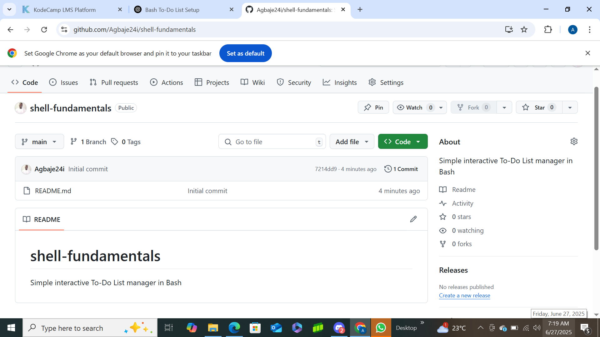
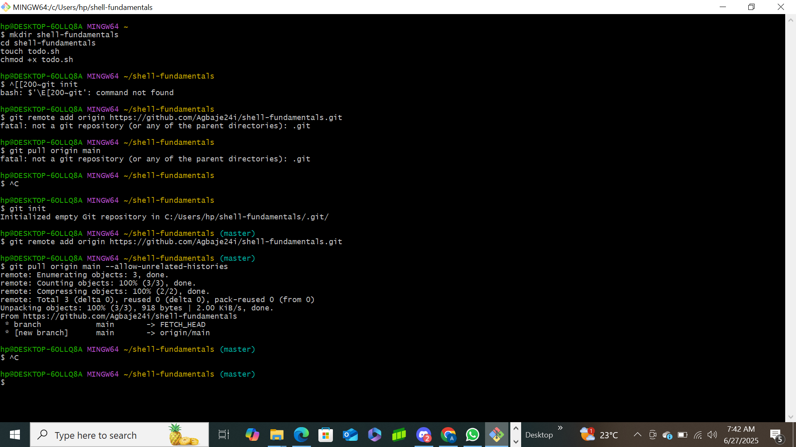
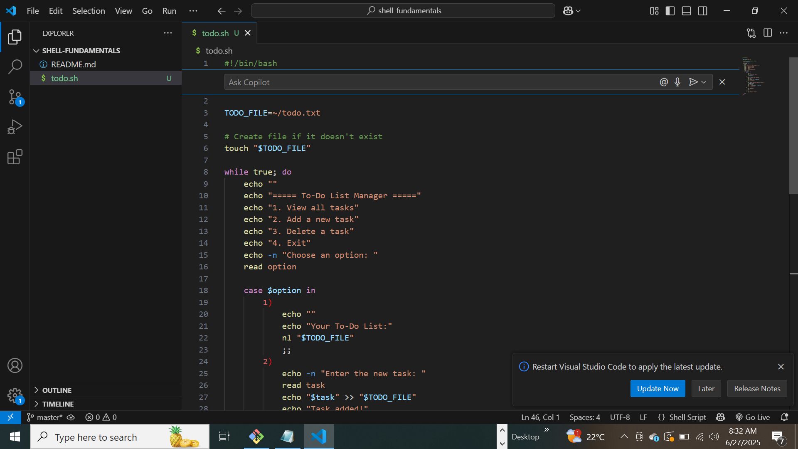
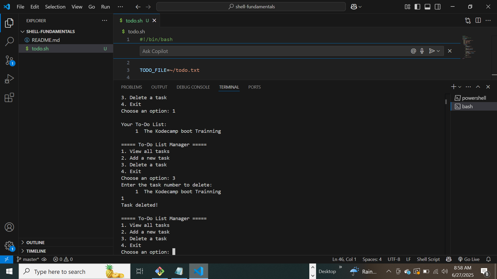

## 📸 Screenshots & Description

### ✅ 1. Adding a Task

I selected option `2` and added the task: **"The Kodecamp boot Trainning"**. This confirmed that the script can store user input to `~/todo.txt`.

---

### ✅ 2. Viewing Tasks

I selected option `1` to view all tasks, which used `nl` to show the task with line numbers.

---

### ✅ 3. Deleting a Task

Option `3` I remove a task by entering its number. The script used `sed` to delete the correct line.

---

### ✅ 4. Exiting the Script

Option `4` exits the loop with a friendly goodbye message.

---

### 🧪 Extra: Terminal and Script Execution

---

### 🧪 Extra: File Structure in VS Code

